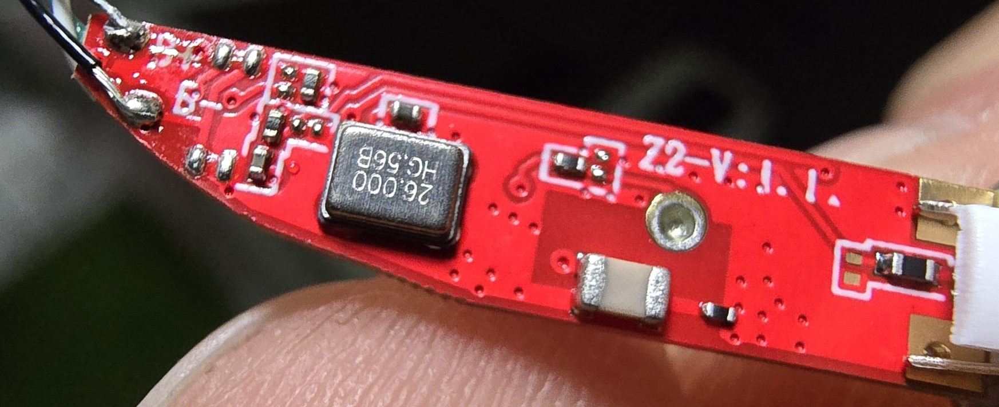

# Bluetrum AB5682 BLE SoC Gadgets Hacking

The Bluetrum SoC Series is an more and more used Cheap BLE Chip for Smartwatches or Headphones

This Repo is currently about the AB5682 which is used in the A9 Pro Airpod Clones which are available sometimes for as los as 5€

The special thing about this Airpod Clone is that the Case itself features a full Touchscreen LCD and the BLE Enabled SoC
This allows to use it basically like a smartwatch and can connect to a Smartphone App as well as the Headphones to show their battery infos or get the currently played song forwarded from them.

Right now the Headset is not touched and this repo only about the case

There is relatively little infos about Bluetrum details. Some minimal Datasheets with only little details.
But searching deep you can even find an SDK and or Flashing Tool Leak, find that attached in this Repo

The [Downloader_v3.1.2.zip](Downloader_v3.1.2.zip) file is the official tool used to flash the Bluetrum series

The [SDK_AB568X_S519_20231122.zip](SDK_AB568X_S519_20231122.zip) is an older SDK release and used a lot to reverse engineere and to build a custom firmware.

Also there is this very nice tools coolection by [@kagaimiq](https://github.com/kagaimiq) which is mostly concentrated on an other Bluetrum Chip but did allow to adapt and get the needed Bootloader connection [https://github.com/kagaimiq/bluetrum-tools](https://github.com/kagaimiq/bluetrum-tools)

The Debug interface of the Bluetrum series uses a one wire UART Connection, use it with a classic USB-to-UART Converter you can use the following schematic, note that this will not allow too high Baudrates so better set it to 115200 max a better schematic should work better^^

You can find the dumped internal flash of the A9 Pro here [Headset_A9_Pro_Flash_dump.bin](Headset_A9_Pro_Flash_dump.bin)

## Custom Firmware

Currently the [custom_firmware](custom_firmware) is only adapted so it will run in RAM and will be loaded by teh Bleutrum-Tool.
The edited uploader will, after upload wait for any UART Outputs and print those.

Since the stack / pointers will be destroyed by the booting of the custom firmware returning from the custom firmware does not fully work. So only one CMD can be executed in the "Bootloader way". This needs to be looked into so a fully flash reader and writer can be made, flash reading and writing is done manualy right now.

To create a custom firmware that runs from the Internal MCP Flash the full layout still needs to be implemented including the full encryption

## Memory layout

0x100 - 0x1100 = Special Function Register

0x10000 - 0x37C00 = 0x27C00 162816 byte RAM

0x3B000 <- Also some kind of RAM

0x80000 - 0x98000 = 0x18000 98304 byte ROM

0x10000000 = Internal SPI Flash memory mapped (Only after activating!)

MCP Internal flash is 2MB so 0x000000 - 0x200000
CS:   2
SCK:  4
MOSI: 5
MISO: 1
WP:   0 <- Unknown
HOLD: 3 <- Unknown
Flash-ID: 00856015

## Userkey Codekey

In the AB5682B the Encryption key for the Application is saved in the EFUSE and is 4bytes long. For the A9 Pro it is: D02F02BF

You can find an example on how to read the EFUSE in the custom firmware

## More Images

